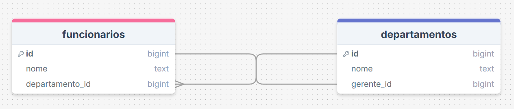
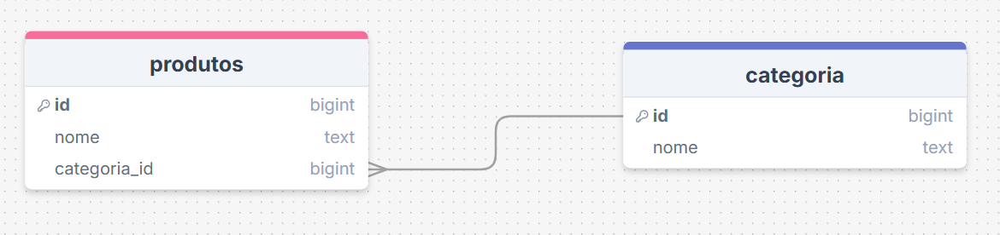

# 🟡 Exercícios Intermediários

## Exercício 4 — Funcionários e Departamento

Tabela inicial:

| funcionario_id | nome | departamento | gerente_departamento |
|---|---|---|---|
| 1 | João | TI | Carlos |
| 2 | Ana | TI | Carlos |
| 3 | Pedro | RH | Maria |

**1. Existe dependência transitiva?**

Existe, pois o atributo `gerente_departamento` depende de `departamente`, o qual trata-se de um atributo não chave.

**2. A tabela está na 3FN?**

Não, pois uma tabela está na Terceira Forma Normal (3FN), quando não há a presença de dependências transitivas.

**3. Como separar corretamente?**

A tabela é fragmentada em duas tabelas `Funcionarios`(composta por id, nome e o id do departamento que esse funcionário trabalha) e `Departamentos` (composta por id, nome e o id do gerente do departamento).

---

## Exercício 5 — Produtos e Categoria

Tabela inicial:

| produto_id | produto_nome | categoria_id | categoria_nome |
|---|---|---|---|
| 1 | Notebook | 10 | Informática |
| 2 | Mouse | 10 | Informática |
| 3 | Geladeira | 20 | Eletrodomésticos |

Perguntas:

**1. Qual dependência funcional existe?**

Dependência Funcional Parcial, pois `categoria_nome` depende apenas de `categoria_id`.

**2. Como ficaria a tabela na 3FN?**

A tabela é dividida em duas tabelas `Produtos` (composta pelos atributos id, nome e o id da categoria do produto) e `Categorias` (composta por id e nome).

---

## Exercício 6 — Matrícula de alunos

Tabela inicial:

| aluno_id | aluno_nome | curso_id | curso_nome |
|---|---|---|---|
| 1 | Ana | 101 | Engenharia |
| 2 | Pedro | 101 | Engenharia |
| 3 | Carlos | 102 | Direito |

Perguntas:

**1. Quais atributos dependem de quais?**

O atributo `aluno_nome` depende de `aluno_id` e o atributo `curso_nome` depende de `curso_id`.

**2. Separe as tabelas corretamente.**

Para normalizá-la, a tabela é dividida em duas novas tabelas `Alunos` e `Cursos`.

---